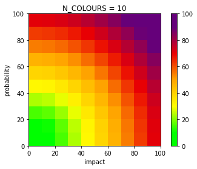
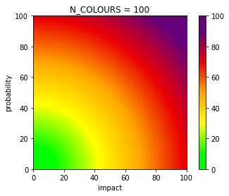

# Risk Matrix Colours

The script will create a continuous colour gradient first, this can
be modified by modifying the transition values and colours in CMAP_COLOURS

Next, a list of length N_COLOURS is drawn from the continuous gradient.

Example output:

Gradient with 10 colours:
['#00ff00', '#0cff00', '#98ff00', '#fff000', '#ffbf00', '#f97601', '#ee1b02', '#b50033', '#6c0074', '#65007a']

 
Gradient with 100 colours:
['#00ff00', '#00ff00', '#00ff00', '#00ff00', '#00ff00', '#00ff00', '#00ff00', '#00ff00', '#00ff00', '#00ff00', '#00ff00', '#0cff00', '#1cff00', '#25ff00', '#34ff00', '#3eff00', '#4dff00', '#58ff00', '#66ff00', '#75ff00', '#80ff00', '#8eff00', '#98ff00', '#a8ff00', '#b6ff00', '#c0ff00', '#d0ff00', '#daff00', '#e8ff00', '#f2ff00', '#fffe00', '#fff900', '#fff500', '#fff000', '#ffec00', '#ffe700', '#ffe200', '#ffde00', '#ffd900', '#ffd600', '#ffd000', '#ffcb00', '#ffc700', '#ffc200', '#ffbf00', '#ffb900', '#ffb600', '#ffb000', '#ffab00', '#ffa800', '#fea000', '#fe9a00', '#fc9000', '#fb8601', '#fa8001', '#f97601', '#f87001', '#f76601', '#f65f01', '#f55601', '#f44c02', '#f34602', '#f23c02', '#f13502', '#f02c02', '#ee2202', '#ee1b02', '#ec1203', '#eb0b03', '#ea0203', '#e30009', '#de000e', '#d60014', '#d10019', '#c90020', '#c40025', '#bc002c', '#b50033', '#af0038', '#a8003f', '#a20043', '#9a004a', '#930051', '#8d0056', '#86005d', '#800062', '#790068', '#73006d', '#6c0074', '#65007a', '#65007a', '#65007a', '#65007a', '#65007a', '#65007a', '#65007a', '#65007a', '#65007a', '#65007a', '#65007a']

